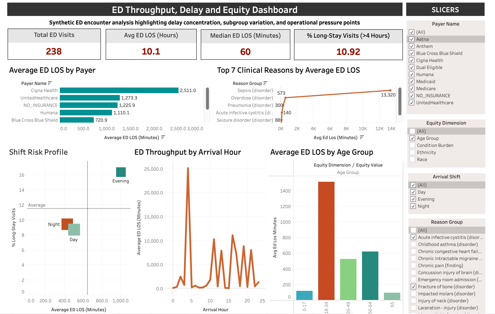

# **ED Throughput, Delay, and Equity Dashboard**

## **Emergency Department Throughput, Delay, and Equity Analytics Using SQL, Excel, and Tableau**

An end-to-end healthcare analytics project examining **emergency department throughput**, **long-stay patterns**, **subgroup variation**, and **operational bottlenecks** using synthetic patient-level encounter data.

This project uses official **Synthea** sample CSV data to build an ED-focused SQL workflow in **Deepnote**, export dashboard-ready summary tables, and deliver an interactive **Tableau** dashboard for healthcare operations and equity review.

The final output is an **executive-style decision support dashboard** designed to help hospital leadership and healthcare analysts identify where throughput pressure is concentrated and which patient, payer, or operational segments may warrant closer review.

---

## **Dashboard Preview**



---

## **Project Snapshot**

- **Project type:** descriptive healthcare operations analytics
- **Analytical level:** patient- and encounter-level ED analysis
- **Main business problem:** identify the factors associated with longer ED throughput times
- **Primary tools:** SQL, Excel, Tableau
- **Main dataset:** Synthea synthetic EHR-style encounter data
- **Output:** interactive Tableau Public dashboard and documented SQL workflow

---

## **Business Problem**

Emergency departments face throughput pressure when a subset of patient encounters remain in the ED for unusually long periods. These delays can signal workflow bottlenecks, capacity issues, subgroup disparities, or complex clinical demand.

This project was designed to answer:

> **Which patient, payer, clinical, and operational factors are associated with longer emergency department throughput times, and where should hospital leadership intervene first?**

More specifically, the analysis asks:

- How large is the ED throughput burden in the cohort?
- Is delay driven by the typical encounter, or by a smaller high-delay subgroup?
- Which payer groups are associated with longer ED LOS?
- Which clinical reasons are associated with the longest stays?
- How do throughput patterns differ by age group and operational timing?

---

## **What Kind of Analysis This Is**

This is a **descriptive healthcare operations and equity analysis**.

It is **not** a causal model and it is **not** a predictive machine learning project. Instead, it is a structured SQL analytics project that:

- builds a clean ED-only encounter cohort
- engineers operational and subgroup features
- summarizes throughput patterns
- identifies long-stay concentration
- translates findings into a leadership-facing dashboard

From a portfolio perspective, this is a strong example of:

- **healthcare operations analytics**
- **encounter-level SQL analysis**
- **dashboard-oriented business intelligence**
- **equity-aware descriptive analysis**

---

## **Tools and Methods Used**

### **Data and Processing**

- **Deepnote SQL**
- **DuckDB-style SQL syntax**
- **Excel**
- **Tableau Public / Tableau Desktop Public Edition**

### **SQL Techniques Demonstrated**

- ED cohort filtering
- `LEFT JOIN`
- `CASE WHEN`
- `COALESCE`
- `GROUP BY`
- `HAVING`
- `CTEs`
- window functions:
  - `ROW_NUMBER()`
  - `COUNT() OVER()`
  - `LEAD()`
- date and time functions:
  - `datediff`
  - `EXTRACT`
  - `dayname`
  - `monthname`
  - `date_trunc`

### **Analytics Techniques**

- encounter-level data cleaning
- ED-only cohort creation
- ED length-of-stay calculation
- long-stay flag construction
- patient demographic enrichment
- payer and subgroup comparison
- repeat ED utilization logic
- next-encounter inpatient sequencing
- dashboard-ready summary table design

---

## **About the Data**

This project uses:

- **Synthea sample data**
  - official synthetic patient-level healthcare data
  - CSV files for patients, encounters, conditions, payers, organizations, and providers
- **CMS Timely and Effective Care**
  - referenced as real-world benchmarking context for ED throughput concepts in the project framing

### **Core Files Used**

- `patients.csv`
- `encounters.csv`
- `conditions.csv`
- `payers.csv`
- `organizations.csv`
- `providers.csv`

### **Important Data Note**

This project uses **synthetic EHR-style encounter data**, not real hospital operational records.

Because Synthea does **not** provide a true bed-request to inpatient-transfer boarding timestamp, the project is framed as an **ED throughput and delay** analysis rather than a strict inpatient boarding analysis.

---

## **Project Workflow**

### **1. Data Preparation**

- downloaded official Synthea sample CSV files
- selected the six core files needed for the analysis
- reviewed table structure and join keys
- documented the data dictionary in Excel

### **2. SQL Cohort Construction**

- filtered encounters to `ENCOUNTERCLASS = 'emergency'`
- removed rows with missing or invalid timing
- calculated ED LOS in minutes
- created a reusable ED cohort query

### **3. Feature Engineering**

- joined patient demographics into the ED cohort
- calculated age at encounter
- created age groups
- derived arrival hour, weekday, month, and shift
- joined payer details
- created long-stay and repeat-utilization flags

### **4. Advanced SQL Analysis**

- summarized patient condition burden
- used window functions to sequence encounters by patient
- identified the next encounter class for each ED visit
- created a next-encounter inpatient flag
- generated dashboard-ready analytical outputs

### **5. Dashboard Development**

- exported final analytical CSVs
- built a Tableau dashboard with KPI cards and five supporting visuals
- created interactive filters and exploratory views for subgroup and operational review

---

## **Key Variables and Metrics**

### **Encounter and Throughput Metrics**

- ED encounter start and stop timestamps
- ED LOS in minutes
- long-stay flag for ED visits over 4 hours
- repeat ED user flag
- next encounter inpatient flag

### **Demographic and Equity Variables**

- age at encounter
- age group
- race
- ethnicity
- gender
- county

### **Operational Variables**

- arrival hour
- arrival weekday
- arrival shift
- arrival month

### **Clinical and Coverage Variables**

- payer name
- reason description
- condition burden count
- condition burden group

---

## **Key Project Metrics**

- **ED visits analyzed:** 238
- **Average ED LOS:** 605.7 minutes
- **Median ED LOS:** 60.0 minutes
- **Long-stay ED visits:** 26
- **Long-stay rate:** 10.92%
- **Repeat ED visit rows:** 202
- **Repeat ED rate:** 84.87%
- **ED visits where next encounter was inpatient:** 17
- **Next-encounter inpatient rate:** 7.14%

---

## **Key Findings**

### **1. The ED LOS distribution is highly skewed**

The median ED LOS was **60 minutes**, while the average ED LOS was **605.7 minutes**.

This suggests that a smaller number of extremely long encounters are pulling the mean upward and likely driving a disproportionate share of the throughput burden.

### **2. Evening shift appears to be the highest-risk operational period**

From the shift summary:

- **Evening shift average ED LOS:** 1005.4 minutes
- **Evening shift long-stay rate:** 16.39%

Compared with:

- **Day shift average ED LOS:** 502.2 minutes
- **Night shift average ED LOS:** 431.0 minutes

This suggests evening operations may warrant the closest workflow review.

### **3. Payer groups showed substantial throughput variation**

Selected payer results:

- **Cigna Health:** 2511.0 average ED LOS
- **UnitedHealthcare:** 1273.3 average ED LOS
- **NO_INSURANCE:** 1225.9 average ED LOS
- **Dual Eligible:** 63.4 average ED LOS

This indicates payer-associated variation in throughput and long-stay concentration in the synthetic cohort.

### **4. Clinical reason groups also showed meaningful delay concentration**

Selected reason groups:

- **Sepsis (disorder):** 13320.0 average ED LOS, 100% long-stay
- **Overdose (disorder):** 573.3 average ED LOS, 55.56% long-stay
- **Pneumonia (disorder):** 300.0 average ED LOS, 66.67% long-stay

These findings support the idea that a smaller subset of clinically complex or acute encounters may drive extreme LOS values.

### **5. Age group differences were visible in the cohort**

Selected age-group results:

- **Ages 18-34:** 1512.6 average ED LOS
- **Ages 50-64:** 620.7 average ED LOS
- **Ages 35-49:** 524.4 average ED LOS
- **Ages 65+:** 95.8 average ED LOS
- **Ages 0-17:** 119.2 average ED LOS

This supports an equity lens in the dashboard and highlights subgroup variation in throughput burden.

---

## **Dashboard Views**

### **KPI Cards**

- Total ED Visits
- Average ED LOS (Hours)
- Median ED LOS (Minutes)
- % Long-Stay Visits

### **Average ED LOS by Payer**

A payer-level comparison showing which coverage groups are associated with longer average ED stays.

### **ED Throughput by Arrival Hour**

A timing-based operational view showing how average ED LOS changes across hours of the day.

### **Top Clinical Reasons by Average ED LOS**

A clinical driver view highlighting which encounter reasons are associated with the longest average stays.

### **Equity Comparison**

A subgroup comparison view used to examine ED LOS variation across age or other equity-relevant categories.

### **Shift Risk Profile**

A shift-level operational risk view combining average ED LOS, long-stay rate, and ED visit volume.

---

## **Why This Project Matters**

This project reflects the type of work used in:

- healthcare operations analytics
- public health analytics
- hospital performance monitoring
- dashboard-based business intelligence

It demonstrates how encounter-level data can be used to support:

- throughput review
- operational bottleneck identification
- subgroup variation review
- healthcare access and payer-pattern exploration
- executive dashboard communication

Rather than claiming causal effects, this project functions as a **descriptive operations and equity review tool**.

---

## **Repository Structure**

```text
ed-throughput-admission-delay-analytics/
├── README.md
├── .gitignore
├── dashboard/
│   ├── Dashboard_Preview.png
│   └── ed_throughput_delay_equity_dashboard.twbx
├── data_clean/
│   └── dashboard_exports/
│       ├── ed_analysis_final.csv
│       ├── equity_summary.csv
│       ├── hour_weekday_heatmap.csv
│       ├── kpi_summary.csv
│       ├── monthly_trend.csv
│       ├── payer_summary.csv
│       ├── reason_summary.csv
│       └── shift_summary.csv
├── data_raw/
│   ├── core/
│   │   ├── patients.csv
│   │   ├── encounters.csv
│   │   ├── conditions.csv
│   │   ├── payers.csv
│   │   ├── organizations.csv
│   │   └── providers.csv
│   └── synthea_sample_data_csv_latest/
├── excel/
│   └── data_dictionary.xlsx
├── insights/
│   ├── executive_summary.md
│   └── join_map.txt
└── sql/
    ├── 01_schema.sql
    ├── 02_data_understanding.sql
    ├── 03_ed_cohort_cleaning.sql
    ├── 04_feature_engineering.sql
    ├── 05_advanced_features.sql
    └── 06_dashboard_outputs.sql
```

### **What Each Folder Contains**

- **`dashboard/`**
  - final Tableau workbook
  - dashboard preview image used in the README

- **`data_clean/dashboard_exports/`**
  - final dashboard-ready CSV exports used for Tableau visuals

- **`data_raw/`**
  - original source CSVs used in the project

- **`excel/`**
  - supporting Excel-based data dictionary

- **`insights/`**
  - supporting notes and written summary material

- **`sql/`**
  - all SQL scripts used across setup, cleaning, feature engineering, and dashboard output creation

---

## **What’s Included in This Repository**

- SQL scripts for setup, cleaning, feature engineering, and dashboard outputs
- dashboard-ready CSV exports
- Tableau workbook
- dashboard preview image
- Excel data dictionary
- supporting notes and join map
- project documentation

---

## **Tableau Dashboard**

**Tableau Public Link:**  
https://public.tableau.com/app/profile/sowmya.deshpande8412/viz/Book1_17845201849080/EDThroughputDashboard

---

## **Limitations**

- the patient-level data are synthetic, not real hospital EHR or throughput records
- ED LOS is based on encounter start and stop times available in Synthea, not true operational bed management timestamps
- next-encounter inpatient logic is descriptive and limited by the structure of synthetic encounter sequencing
- several subgroup summaries rely on a modest ED sample size of 238 encounters
- results are descriptive and should not be interpreted as causal

---

## **About Me**

Created by **Sowmya Deshpande**  
Healthcare Data Analyst | Public Health Analytics | SQL | R | Tableau | Excel | Population Health | Healthcare Operations Analytics
